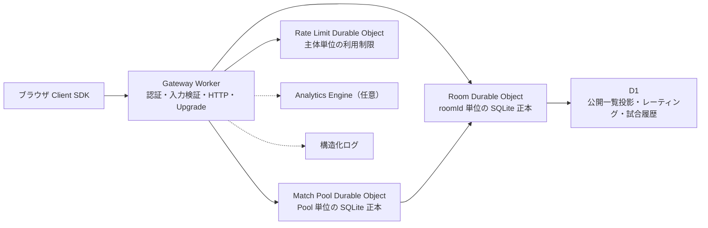
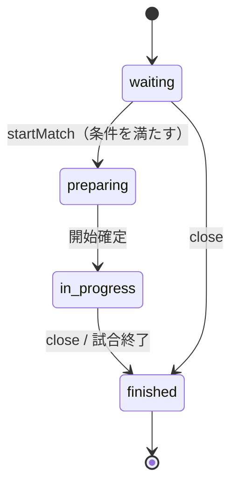
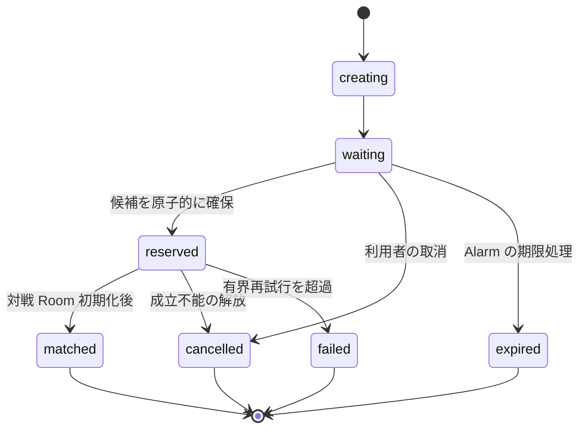
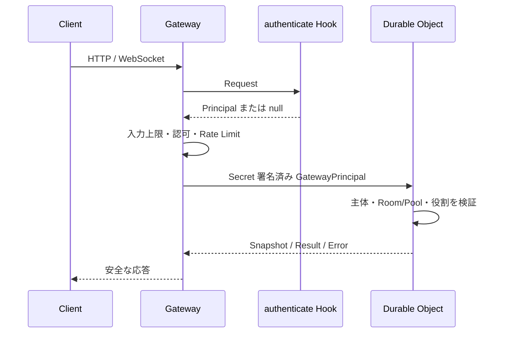

# アーキテクチャ

この文書は FlareLobby v0.1.0 の実装境界を示します。設計の正本は
[Issue #1](https://github.com/katsu996/FlareLobby/issues/1) であり、ここでは実装と
運用に必要な保存境界、整合性、復旧経路を補足します。

## コンポーネント境界

| 構成要素 | 識別単位 | 正本と責務 |
| --- | --- | --- |
| Client SDK | Client インスタンス | HTTP/WebSocket、読み取り専用 Snapshot、再接続、イベント購読 |
| Gateway Worker | HTTP 要求 | 認証、認可 Hook、入力上限、公開 API、DO へのルーティング |
| Room Durable Object | `roomId` | 参加者、ホスト、チーム、設定、状態、revision、接続、期限、冪等結果 |
| Match Pool Durable Object | `gameId:seasonId:mode:region` | チケット、候補確保、成立意図、イベント、期限、単一 Alarm |
| Rate Limit Durable Object | 認証主体 ID | 主体ごとの WebSocket/ルーム作成頻度。全主体を一つへ集約しない |
| D1 | 共有データ | 公開ルーム一覧投影、Season/Rating/Match/Participant 履歴 |
| Analytics Engine | 任意 Binding | 待機時間、レート差、成立・キャンセル品質メトリクス |

Room と Match Pool は 1 個のグローバル Durable Object に集約しません。Pool から
Room を初期化する場合も、Pool の整合性境界で成立意図を先に保存し、Room の初期化
結果を確認してからチケットを `matched` へ進めます。

## 保存境界

| データ | 保存先 | 失われた場合の扱い |
| --- | --- | --- |
| Room 本体、参加者、チーム、ホスト | Room SQLite | 復元不能。メモリだけで再構成しない |
| Room Snapshot の `revision` とイベント履歴 | Room SQLite | 履歴不足時は完全 Snapshot を再送する |
| 再開セッション、切断猶予、処理済みコマンド | Room SQLite | 期限処理と冪等性を再実行可能にする |
| Room の公開一覧投影同期 | Room SQLite の pending operation + D1 | Room 操作を失敗させず、Alarm で再試行する |
| Pool、チケット、候補、成立意図、チケットイベント | Match Pool SQLite | Alarm/再生成後に未完了処理を再開する |
| Season、Rating、Match、Match Participant | D1 | D1 batch と版番号で片側更新を防ぐ |
| 認証主体、参加トークン、秘密値 | リクエスト/Secret | ログ、D1、Snapshot、URLへ保存しない |
| Client の `snapshot` | メモリ上のキャッシュ | 接続・再同期時にサーバーの正本で置換する |

メモリ上の値は in-flight 処理やクライアント表示のキャッシュに限定します。
Durable Object のインスタンス再生成、WebSocket Hibernation、Worker の別リクエスト
をまたぐ保証をクラスプロパティへ置きません。

## Room 状態遷移

同じ状態への再送は現在の Snapshot へ収束します。`finished` からの逆戻り、終了済み
Room の操作、開始条件を満たさない `startMatch()` は拒否します。状態変更ごとに
`revision` を増やし、購読者は `lastRevision + 1` だけを適用します。

## Match Pool 状態遷移

同じチケットを二つの候補へ予約せず、`matchId` と対戦 Room ID は候補から決定的に
生成します。成立処理を再実行しても別の Room や別の結果を作りません。

## 再接続の順序

1. Gateway が参加用または再開用 WebSocket subprotocol を検証する。
2. Room Durable Object が主体、Room、役割、参加者、nonce、期限を照合する。
3. 接続が切れているだけなら参加者行を消さず、切断猶予の Alarm を登録する。
4. Client SDK が最後の `revision` と再開トークンを使って再接続する。
5. 有界履歴に連続差分があれば差分を順に送信し、履歴不足なら完全 Snapshot を送る。
6. 明示的な `leave()`、`kick()`、`close()` では再開セッションを無効化する。
7. 切断猶予が切れた場合だけ参加者を退出させ、ホストなら最古のプレイヤーへ移譲する。

通信切断と明示退出を同じ操作として扱わないことが、再接続とホスト移譲を両立する
ための前提です。

## 整合性と冪等性

- Client の同じ操作は `requestId` と操作対象の組で処理済み結果へ収束させる。
- 同じ `requestId` に異なるコマンドまたは Payload を指定した場合は `CONFLICT` とする。
- Room の定員、Pool の候補予約、状態変更は Durable Object の SQLite 入力ゲート内で行う。
- D1 の結果登録は `matchId`/`resultId`、Rating の version、試合行、2 人分の履歴を一つの batch で確定する。
- D1 の公開ルーム一覧は最終判定ではない。参加時は必ず Room SQLite を再確認する。
- Alarm は Room/Pool ごとに最も近い期限だけを持ち、同じ処理を再実行しても二重イベントを作らない。

## 認証・認可の境界

Client が送った `playerId` は本人確認に使いません。Gateway は認証 Hook の結果を
短命な内部証明へ束縛し、Durable Object はその証明だけを受け付けます。試合結果の
参加者も本文から採用せず、成立済みチケットから復元します。

## 対象外との境界

このアーキテクチャはロビー状態とマッチ成立後の接続を扱います。ゲーム本体の高頻度
同期、ランキング UI、パーティー編成、外部認証サービス自体、Bot/チート対策、
管理画面は別のシステムまたは設計変更提案が必要です。

## 関連 ADR

- [ADR-0001: Durable Object と SQLite を正本にする](./adr/0001-durable-object-sqlite.md)
- [ADR-0002: revision と再開トークンで再接続する](./adr/0002-reconnect-and-revision.md)
- [ADR-0003: 公開ルーム一覧を D1 の投影にする](./adr/0003-public-room-index.md)
- [ADR-0004: 試合結果の信頼境界をサーバー側に置く](./adr/0004-match-result-trust-boundary.md)
